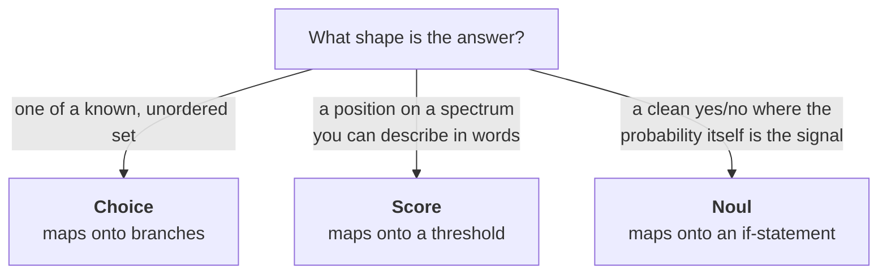
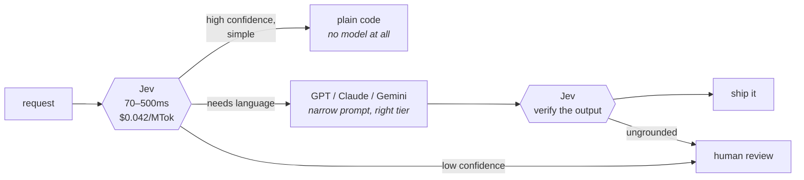

# jev-playground

**A working engineer's playground for Jev — TypeSafe's System One model.**

Runnable code samples, diagrams, and cookbooks for the thing Jev is actually good at:
making a *lot* of small, typed, calibrated decisions fast — including inside systems
you already built around OpenAI, Claude, or Gemini.

> Everything here is written for someone who has to put this in a request path, not
> someone evaluating a demo.

---

## Table of contents

- [The one-paragraph version](#the-one-paragraph-version)
- [Why this is a different shape of model](#why-this-is-a-different-shape-of-model)
- [Hello, Jev](#hello-jev)
- [Three primitives, and only three](#three-primitives-and-only-three)
- [Why parallel sampling is the whole story](#why-parallel-sampling-is-the-whole-story)
- ["Cannot hallucinate" is a claim about the output space](#cannot-hallucinate-is-a-claim-about-the-output-space)
- [Confidence is control flow, not telemetry](#confidence-is-control-flow-not-telemetry)
- [The numbers, and how much weight to put on them](#the-numbers-and-how-much-weight-to-put-on-them)
- [Where it breaks](#where-it-breaks)
- [Cookbooks: Jev + your existing LLM](#cookbooks-jev--your-existing-llm)
- [See it running](#see-it-running)
- [Setup](#setup)
- [How to pilot this without betting anything](#how-to-pilot-this-without-betting-anything)

---

## The one-paragraph version

Jev is deliberately worse than the models you already use. It cannot write. It cannot
explain itself. It cannot look anything up. It has no idea what happened in the world
after you stopped typing. What it does instead is answer bounded questions about a blob
of state — all of them at once, in the time a database returns a moderately complex join.
TypeSafe calls the category a **System One model**, after Kahneman's fast, intuitive
System 1, and the pitch aims squarely at the gap between "the demo worked" and "we put it
in the request path."

The mental model that makes it click:

> **A frontier-intelligence function call. Unstructured state in, typed probabilistic decisions out.**

---

## Why this is a different shape of model

You have been using a System 2 model to make System 1 decisions. "Which bucket is this?"
"Is this urgent?" "Does this passage matter?" Those were never reasoning problems. They
got routed through a chat model because a chat model was the only thing available that
understood language at all. You paid for that mismatch in latency budgets, retry loops,
review queues, and a pile of pilots that worked in the demo and never shipped.

```text
  LLM · System 2 — sequential
  ──────────────────────────────────────────────────────────────────

    prompt ─▶ tok ─▶ tok ─▶ tok ─▶ tok ─▶ "…a string"
                                               │
                                               ▼
                       parse ─▶ validate ─▶ retry on failure

    every token waits for the one before it, then you parse the result


  Jev · System One — parallel
  ──────────────────────────────────────────────────────────────────

                     ┌─▶ Q1 ─▶ choice + probabilities + confidence
    state            ├─▶ Q2 ─▶ score  + probabilities + confidence
    ingested once ───┤
                     ├─▶ Q3 ─▶ noul
                     └─▶ Q4 ─▶ choice + probabilities + confidence

    every question sees the same state, all in one round trip
```

| | Existing LLMs | System One + Jev |
|---|---|---|
| **Trained with** | RLHF / RLVR | **RLCD** — Reinforcement Learning for Calibrated Decisions |
| **Optimizes for** | Human preference, or verifiable rewards | Calibrated decisions: epistemically honest probabilities |
| **Input** | Unstructured text, emphasis on sequential messages | Unstructured text, emphasis on **structured program state** |
| **Output** | Strings. Must be parsed and validated. Can be anything — including a hallucination | **Type-safe structured values.** Answer space defined in advance |
| **Sampling** | Sequential, one token at a time | **Parallel**, all outputs in a single query |
| **Confidence** | Sounds like confidence | Calibrated: higher confidence genuinely means higher accuracy |
| **Best at** | Chat, copilots, coding agents, verifiable problems, demos | Smart `if`-statements, map-reduce over big data, real-time paths, verifying LLMs |

Neither one replaces the other. The interesting systems use both — which is what the
[cookbooks](#cookbooks-jev--your-existing-llm) are about.

---

## Hello, Jev

There is no prompt here in the sense you are used to. There is **state** — a string, a
JSON object, or an array of text — and there are **questions**, each of which declares its
own answer space *before the model runs*.

```python
from typesafe_sdk import Choice, Noul, Score, TypeSafeClient

client = TypeSafeClient()  # reads TYPESAFE_API_KEY, defaults to jev-latest

response = client.system_one(
    state={
        "ticket": {
            "subject": "Duplicate charge",
            "messages": [
                {"from": "customer",
                 "text": "I was charged twice for order A-104. Please refund the duplicate."},
            ],
        },
        "order": {"id": "A-104", "charges": [
            {"amount_usd": 49, "status": "captured"},
            {"amount_usd": 49, "status": "captured"},
        ]},
        "refund_policy": "Duplicate charges are eligible for a refund.",
    },
    questions={
        "department": Choice(
            instructions="Which team should handle this",
            criteria={
                "billing":   "Payment or subscription issues",
                "technical": "Bugs or integration problems",
                "sales":     "Pricing or account questions",
            },
        ),
        "frustration": Score(
            instructions="How frustrated the customer appears",
            criteria=["Calm, just stating facts",
                      "Frustrated but civil",
                      "Very angry, strong language"],
        ),
        "refund_requested": Noul(
            instructions="The customer is explicitly asking for a refund"),
        "policy_supports": Noul(
            instructions="The stated refund policy covers this situation"),
    },
)

dept = response.answers["department"]
print(dept.choice, dept.confidence)               # "billing" 0.97
print(response.answers["frustration"].score)      # 1.035
print(response.answers["refund_requested"].noul)  # 0.98
```

One endpoint backs all of it:

```http
POST https://api.typesafe.ai/v1/systemone
Authorization: Bearer <API_KEY>
Content-Type: application/json
```

<details>
<summary><b>The same call in TypeScript</b> — the result type is inferred from your questions</summary>

```typescript
import { choice, noul, score, TypeSafeClient } from "@typesafe-ai/sdk";

const client = new TypeSafeClient();

const response = await client.systemOne({
  state: { document: "I was charged twice. Please fix this ASAP." },
  questions: {
    category: choice("What is this ticket about?", {
      billing:   "Payment or subscription issues",
      technical: "Bugs or integration problems",
      other:     "Anything else",
    }),
    frustration: score("How frustrated the customer appears", [
      "Calm", "Frustrated but civil", "Very angry",
    ]),
    urgent: noul("The message conveys urgency"),
  },
});

response.answers.category.choice;  // "billing" | "technical" | "other" — not `string`
```

Your editor knows the answer space, because you declared it.
</details>

<details>
<summary><b>The same call as raw HTTP</b></summary>

```bash
curl -X POST https://api.typesafe.ai/v1/systemone \
  -H "Authorization: Bearer $TYPESAFE_API_KEY" \
  -H "Content-Type: application/json" \
  -d '{
    "state": "Help! My payouts have been failing for 3 days.",
    "model": "jev-latest",
    "questions": {
      "department": {
        "type": "choice",
        "instructions": "Which team should handle this?",
        "criteria": {
          "billing":   "Payments, invoicing, refunds",
          "technical": "Bugs, outages, integrations",
          "sales":     "Pricing, upgrades, new accounts"
        }
      },
      "is_urgent": { "type": "noul", "instructions": "Does this convey urgency?" }
    }
  }'
```

```json
{
  "model": "jev-1.13.0",
  "answers": {
    "department": {
      "type": "choice",
      "choice": "technical",
      "confidence": 0.78,
      "probabilities": { "technical": 0.85, "billing": 0.15, "sales": 0.0 }
    },
    "is_urgent": { "type": "noul", "noul": 1.0 }
  },
  "usage": { "input_tokens": 392, "output_tokens": 65 }
}
```
</details>

---

## Three primitives, and only three

The entire API surface is three question types. TypeSafe is explicit that this is the
design, not a limitation to route around.

| Primitive | Asks | Returns |
|---|---|---|
| **`Choice`** | Which one of these options? | `.choice`, `.probabilities` per option, `.confidence` |
| **`Score`** | Where on this ordered spectrum? | `.score` (continuous, can land *between* levels), `.legend`, `.probabilities`, `.confidence` |
| **`Noul`** | Is this statement true? | `.noul` — a single probability from 0 to 1 |

**`Choice`** takes up to **255 options**, each costing a few tokens. Because the marginal
cost of an option is so low, the guidance inverts the usual instinct to pre-filter: pass
the *full* list of teams, categories, or SKUs rather than a shortlist. Add an explicit
`other` option so the model can say nothing fits, instead of picking the closest wrong thing.

**`Score`** takes **two to ten ordered levels**, described in words rather than numbers.
The level index comes from array order, so level `0` is the first entry. The returned
score is continuous — `1.035` means "just past the second level." That continuity is the
useful part: you can threshold in code at a granularity the levels themselves don't express.

**`Noul`** — TypeSafe's coinage for a probabilistic boolean — returns a bare number and,
notably, **no confidence field**. There is nothing to add: the number already *is* the belief.

### Pick the type whose answer your code can act on directly



A `Noul` of `0.5` means the model gives yes and no equal probability. It does **not** mean
"medium." If you want to measure a level, use a `Score` with defined levels.

### Ask one thing per question

Ask for a judgment a knowledgeable person makes in a second, given the right context.

- ✅ *"Does this message convey urgency?"*
- ❌ *"Analyze this message and determine the best course of action."*

If the judgment depends on several independent factors, ask each factor separately and
combine the answers with your own logic. Instead of *"rate this startup pitch"*, ask about
market size, technical feasibility, and differentiation, then weight them in code. When
priorities shift you change a coefficient, not a prompt.

---

## Why parallel sampling is the whole story

Here is the architectural claim, and everything else follows from it.

An autoregressive model generates one token at a time, each conditioned on every token
before it. That sequential dependency is what lets an LLM write an essay — and it is also
what makes it slow, because you cannot compute token *n+1* until token *n* exists. Ask an
LLM ten questions in one prompt and it answers them in sequence; the tenth answer waits for
the first nine.

Jev gives up string generation and, with it, the sequential dependency. It ingests the
state **once** and evaluates every question against it **in parallel**, in a single query.

The practical consequence is a rule that will feel wrong for about a day:

> ### Ask everything up front.

Adding a question barely changes response time, and costs only the tokens for that
question. TypeSafe calls this **speculative fan-out**. Its cookbook reports that batching a
13-question regulatory briefing over a long article into one call is **12.2× cheaper and
10.0× faster** than asking one at a time, with identical answers.

```python
response = client.system_one(
    state=ticket,
    questions={
        "category": Choice(
            instructions="Broad category of this ticket",
            criteria={"bug_report":      "Something is broken or erroring",
                      "billing":         "Charges, invoices, refunds",
                      "feature_request": "Asking for new functionality",
                      "account":         "Login, permissions, security"}),

        # Only meaningful if it IS a bug report. Ask anyway — it is nearly free.
        "bug_severity": Score(
            instructions="How severe is the reported issue",
            criteria=["Cosmetic; no impact",
                      "Degraded feature; workaround exists",
                      "Blocking; no workaround"]),
        "has_repro": Noul(instructions="The user describes steps to reproduce"),

        # Only meaningful if it IS billing. Ask anyway.
        "refund_wanted": Noul(
            instructions="The user explicitly asks for a refund or credit"),
    },
)

a = response.answers
if a["category"].choice == "bug_report":
    if a["bug_severity"].score > 1.5 and a["has_repro"].noul > 0.6:
        escalate_to_engineering(ticket_id, severity="high")
    else:
        add_to_bug_backlog(ticket_id)
elif a["category"].choice == "billing" and a["refund_wanted"].noul > 0.7:
    start_refund_flow(ticket_id)
```

You are no longer designing a conversation. **You are designing a query plan** — and the
branch selection happens in your code, on data that is already local, with zero additional
round trips.

Context works accordingly: `jev-1.13` allows **64k tokens** for the state and all questions
combined, and **32k** for the state plus the single longest question, because the state is
ingested once and the questions run against it. Each question is evaluated independently,
so adding questions does not create context rot between them.

---

## "Cannot hallucinate" is a claim about the output space

This gets misread most often, so be precise about it.

The claim is **not** that Jev is never wrong. It is that **Jev cannot return something
outside the answer space you declared.** A `Choice` returns one of your keys. A `Score`
returns a number bounded by your levels. A `Noul` returns a float in `[0, 1]`. There is no
code path that produces a fabricated option, a malformed JSON object, or a key you did not
define — the sampler is *constrained* to the space, rather than being asked politely to
stay inside it.

TypeSafe is refreshingly direct about the epistemics: schema matching is guaranteed, so the
0% type-error figure in their charts **"is not empirical"** — it is a structural property,
and a single counter-example would falsify it. The comparison numbers for LLMs come from
OpenRouter traffic, which they flag as carrying routing bias.

Why this matters more than it sounds: a hallucinated tool call in an interactive agent is an
annoyance a human notices and corrects. The same failure buried four layers deep in a
dependency chain, behind a latency guarantee, at three in the morning is an *incident*.
Retry-and-validate loops paper over it at the cost of exactly the tail latency you were
protecting. **Removing the failure mode from the type system is categorically different
from making it rarer.**

What Jev can still be is *wrong within the space* — confidently routing a ticket to
`billing` when a person would have said `technical`. Which is why the second half of the
design exists.

---

## Confidence is control flow, not telemetry

Ask a chat model for its confidence and you get a number that *sounds like* confidence.
Models optimized on human preference tend to be overconfident and inconsistent, because
assertive text reads better to a rater than hedged text. That failure is subtle and
expensive:

> If a model can do a task 95% of the time but cannot tell you when it is in the 5%,
> **you cannot automate that task.** You review all of it, and the review cost eats the saving.

Jev is trained with **RLCD** — Reinforcement Learning for Calibrated Decisions — which
optimizes probabilities against *outcomes* rather than against preference. The target is
epistemic honesty: higher confidence should genuinely mean higher accuracy.

Two caveats the docs state plainly, and you should hold onto:

1. **Calibration is a population property.** It does not promise any individual answer is right.
2. **`confidence` is a derived statistic**, computed from the probability distribution the
   answer already carries. Concentrated distribution → high confidence; flat → low. You
   always get the raw `probabilities`, so if TypeSafe's definition isn't the measure you
   want, compute your own.

A flat distribution is a **diagnostic**, not just a number. It usually means the options
weren't distinguishable from the state you provided — more often a defect in your criteria
than confusion in the model.

### Thresholds are a risk decision, not a config value

Once confidence is trustworthy in aggregate, it stops being telemetry and becomes control
flow. The pattern that actually changes your architecture: **one threshold per action,
scaled to what being wrong costs** — not one global threshold for the system.

```python
action = response.answers["action"]

if action.confidence < 0.5:
    route_to_human(user_message)            # floor: the model says it does not know

elif action.choice == "check_balance":
    show_balance(account_id)                # read-only; wrong screen is recoverable

elif action.choice == "approve_transfer":
    if action.confidence > 0.9:             # moves money; irreversible
        confirm_then_execute(account_id)
    else:
        ask_user_to_confirm(account_id)

else:
    route_to_human(user_message)
```

Note what happened to the code review. Risk tolerance is no longer buried in a prompt a
non-engineer edited last quarter. It is a numeric literal next to the action it guards,
in a file with a git history.

### Pin your version

Aliases move. `jev-latest` resolves to `jev-1.13.0` today, and the answers behind an alias
can change without a change on your side.

```python
client = TypeSafeClient(model="jev-1.13.0")   # pin, don't drift
```

| Alias | Points to | Meaning |
|---|---|---|
| `jev-latest` | `jev-1.13.0` | Most recent stable release. SDK default. |
| `jev-preview` | `jev-1.13.0` | Most recent release, official or not. |

The response's `model` field reports the versioned ID that actually answered — log it.

---

## The numbers, and how much weight to put on them

| | Jev (`jev-1.13`) | Frontier LLMs |
|---|---|---|
| **End-to-end latency** | 70–500 ms | 3–329 s |
| **Input price** | $0.042 / MTok | $0.20–$10 / MTok |
| **Output price** | free | ~5× input |
| **Sampling** | parallel, single pass | sequential, token by token |
| **Structured-output errors** | 0% *by construction* | 0.58%–45.5% (OpenRouter) |
| **Rate limits** | 250k tokens/sec, 1,200 req/min | varies |
| **Context** | 64k total; 32k state + longest question | varies |
| **Input modalities** | text only (string, JSON object, array) | often multimodal |

TypeSafe's headline claims of **193.6× faster** and **444.6× cheaper** come from its own
*workflow evaluations*, in which every model gets the same compute graph and is scored
against the average of two frontier models as a reference. The methodology is more honest
than most launch benchmarks — it evaluates models *inside a workflow* rather than on a
leaderboard classification task, which is the right unit of analysis — and the company
lists its own biases: the reference answers skew toward the two vendors used as ground
truth, and the workflows were authored by its own capabilities team.

> **The correct engineering response is neither credulity nor dismissal.** These are
> vendor-reported, self-run, not yet independently reproduced. They are a strong reason to
> run a shadow evaluation on your own traffic, and no reason at all to change a production
> threshold before you do.

Two more things worth flagging honestly. Jev is in **early access with a waitlist**, and
TypeSafe says rate limits are adjusting dynamically while it serves launch demand — a real
dependency consideration for anything production-bound. And the published evidence is young
and largely self-reported. That is not a reason to ignore it. It is a reason for your shadow
period to be longer than you would like.

---

## Where it breaks

TypeSafe publishes a **jaggedness page** for `jev-1.13` — a documented list of its own
failure modes — which is a better signal about the team than any benchmark on the page.
Read it before your design review, not after your incident.

| # | Failure mode | Do this instead |
|---|---|---|
| 1 | **Literal reading.** Scoping words, negations and implied conditions are taken at face value. | Write the exact condition. Put boundary cases in the criteria. When you explain what you *really meant*, that explanation is the missing half of your instruction. |
| 2 | **Math and numbers.** Counting and arithmetic are unreliable. Numeric representations underperform semantic ones (color *names* beat hex values). | Keep arithmetic in code. Convert to semantic buckets first, then ask the judgment question. |
| 3 | **Dates and times.** Read as text, not as ordered quantities. | Extract components with a `Choice` over enumerated options — twelve months, thirty-one days — and compare in code. |
| 4 | **Indirection.** A property of a property, or a double negative, is measurably worse. | Reduce hops. Name the relevant part of the state directly, in backticks. |
| 5 | **Context rot.** Accuracy falls as the state fills with material the question doesn't need. | Retrieve and filter in code first. Send only the fields the question uses. |
| 6 | **Adversarial content.** State is not treated as hostile. Text written to steer its own classification can move the answer. | Write precise criteria, test edge cases, treat it as defence in depth — not a perimeter. |
| 7 | **Contradictory instructions and criteria.** A `Noul` whose `true` maps to "no" performs worse. | Treat criteria as an extension of the instruction. Align the two. |
| 8 | **Structural invariants don't hold.** A `Noul` and a yes/no `Choice` on the same question return numbers that are *not* interchangeable, and a `Noul` and its negation do not sum to 1. | Ask each decision one way. Never carry a threshold tuned on one primitive over to the other. Enforce identities in code. |
| 9 | **Generation.** It is not trained to produce text. | Use a generative model. That's what the [cookbooks](#cookbooks-jev--your-existing-llm) are for. |

<details>
<summary><b>Why #8 surprises people</b> — the actual numbers from the docs</summary>

*"Is the customer asking for a refund?"* on the ticket
**"I'm not happy with the fit. What are my options here?"**

| `Noul` value | `Choice` P(yes) | `Choice` P(no) | `Choice` confidence |
|---|---|---|---|
| 0.22 | 0.01 | 0.99 | 0.97 |

The same question and its negation, as two separate `Noul`s, on
**"I was charged twice for the same order. Can someone look into this?"**

| `refund` | `not_refund` | Sum |
|---|---|---|
| 0.72 | 0.47 | **1.19** |

A `Choice` is *relative* — which option wins. A `Noul` is *absolute* — and can be low for
every option. They are answering different questions.
</details>

Every one of these points the same direction:

> **Keep the deterministic work in code, and give the model only the part that is genuinely
> a judgment.** That is not a workaround. It is the programming model.

---

## Cookbooks: Jev + your existing LLM

The highest-value pattern is **not replacing your LLM. It is deciding which requests
deserve one.** Each cookbook in [`cookbooks/`](./cookbooks) is a runnable script with
built-in sample inputs, a cost table, and a clearly marked boundary between the Jev part
and the frontier-model part.



| # | Cookbook | What it combines | The point |
|---|---|---|---|
| [01](./cookbooks/01_triage_cascade.py) | **Support triage cascade** | Jev → code \| specialist LLM \| human | One branch never touches a model. Two load *different* specialists — a narrow prompt beats a general one. One escalates honestly. |
| [02](./cookbooks/02_rag_gatekeeper.py) | **RAG gatekeeper** | Jev filters passages → Claude/GPT answers | A `Noul` per passage is cheaper than the tokens you'd spend feeding it to a frontier model to find out it was irrelevant. Also catches prompt injection in retrieved text. |
| [03](./cookbooks/03_agent_guardrails.py) | **Tool-call gating** | Jev gates every tool call in an OpenAI/Anthropic agent loop | Four independent judgments, one round trip, a fraction of a cent, *inside* the latency budget of the call it guards. |
| [04](./cookbooks/04_output_verifier.py) | **LLM output verifier** | LLM generates → Jev judges before it ships | Grounding, citation checking, policy, tone. The generator and the judge should not be the same model. |
| [05](./cookbooks/05_realtime_lead_scoring.py) | **Real-time scoring** | Jev in the request path → LLM only for the top tier | AI inside a user-facing request, where a three-second model call was never an option. Weights live in your code, with a diff and a test. |
| [06](./cookbooks/06_model_router.py) | **Cross-provider router** | Jev picks GPT vs Claude vs Gemini vs nothing | Route by what the task *needs*, not by which key you configured first. Re-weighting is a code change. |

**Start here:** [`cookbooks/README.md`](./cookbooks/README.md)

### The shape they all share

```python
# 1. CODE assembles the state. Precisely. Only what the question needs.
state = build_state(request)

# 2. JEV makes the judgments. All of them, in one call.
answers = client.system_one(state=state, questions=QUESTIONS).answers

# 3. CODE owns the control flow, the thresholds, and the side effects.
if answers["needs_generation"].noul > 0.7 and answers["route"].confidence > 0.8:
    # 4. The LLM does the one thing only an LLM can do.
    reply = llm.generate(SPECIALISTS[answers["route"].choice], state)
```

Whatever assembles the state decides what the model is allowed to know. Pad it and you lose
accuracy; ground it in a weak source and you get a beautifully calibrated judgment about
bad material.

---

## See it running

If you would rather watch the patterns than read them, [`simulations/`](./simulations) has an
animated, interactive page for each cookbook — built for someone who does not write code.
Clone the repo and open [`simulations/index.html`](./simulations/index.html) in a browser — no
build step, no keys, and no model is actually called. (GitHub renders `.html` as source, so the
links below show markup until the repo's [Pages workflow](./.github/workflows/pages.yml) is
switched on: **Settings → Pages → Source: GitHub Actions**. After that they are live at
`exponen-agi.github.io/jev-playground`.)

| | Simulation | What you can play with |
|---|---|---|
| 01 | [Support triage cascade](./simulations/01-triage-cascade.html) | Drag the confidence floor and watch tickets move between the automated and human paths |
| 02 | [The gatekeeper](./simulations/02-rag-gatekeeper.html) | Raise the relevance bar; watch a prompt-injection document get quarantined |
| 03 | [The checkpoint](./simulations/03-agent-guardrails.html) | Move each hazard threshold independently and see verdicts flip |
| 04 | [The second pair of eyes](./simulations/04-output-verifier.html) | Step through four drafts and watch six checks resolve |
| 05 | [Scoring while they wait](./simulations/05-lead-scoring.html) | Re-weight the scoring formula and watch every lead re-sort live |
| 06 | [Picking the right brain](./simulations/06-model-router.html) | Watch requests fan out across no-model, small, reasoning and human paths |

The numbers in them are illustrative rather than measured — they exist to make the *shape*
legible, which is the part that transfers.

---

## Setup

```bash
git clone https://github.com/exponen-agi/jev-playground.git
cd jev-playground

python -m venv .venv && source .venv/bin/activate
pip install -r requirements.txt

cp .env.example .env    # then add your keys
```

You need a `TYPESAFE_API_KEY` ([join the waitlist](https://typesafe.ai)). The frontier-model
keys are optional — every cookbook runs its Jev half without them and tells you which half
it skipped.

```bash
python cookbooks/01_triage_cascade.py
```

| Variable | Needed for |
|---|---|
| `TYPESAFE_API_KEY` | everything |
| `OPENAI_API_KEY` | cookbooks 01, 03, 04, 06 |
| `ANTHROPIC_API_KEY` | cookbooks 02, 03, 04, 06 |
| `GOOGLE_API_KEY` | cookbook 06 |

### Letting your coding agent write the integration

TypeSafe ships an agent skill so Claude Code, Codex, and friends know the exact request
and response shapes:

```bash
# Claude Code
claude plugin marketplace add typesafe-ai/skills
claude plugin install typesafe@typesafe-ai

# Other agents
npx skills add typesafe-ai/skills --skill typesafe-ai
```

---

## How to pilot this without betting anything

A sober adoption path, in order:

1. **Pick one decision.** High volume, low stakes, currently made by either an LLM call or
   a regex-and-hope rule. Ticket categorization and RAG passage filtering are the usual
   first wins.
2. **Shadow it.** Run Jev alongside the incumbent. Log both answers plus Jev's confidence,
   and change *no behavior at all* for a week or two.
3. **Build the calibration curve.** Bucket by confidence, measure accuracy per bucket on
   your own labelled data. **This is the deliverable.** It tells you where your automation
   threshold goes, and it is the artefact that gets sign-off from whoever owns the risk.
4. **Automate the top band only.** Leave everything else on the existing path. Expand the
   band as the evidence supports it, not as the enthusiasm does.
5. **Pin the version** once thresholds are tuned, and re-run the curve before moving.
6. **Keep the arithmetic in code.** Every time you are tempted to ask the model to count,
   compare dates, or compute a magnitude — that is the jaggedness page telling you where
   the bug will be.

---

## Why this is more interesting than another model release

Strip away the numbers and the argument underneath is architectural: **most of the decisions
inside software are System 1 judgments, and we have been renting System 2 to make them.**

Jev is one vendor's early-access bet on that thesis, with numbers that need independent
verification. The thesis itself looks durable regardless of whether this particular model is
the one that wins: *the interface between AI and software should be a typed function call
with an honest probability attached, not a string you hope parses.*

The naming is a tell. Jev is named for **William Stanley Jevons**, whose paradox observed
that making coal-fired engines more efficient *increased* coal consumption rather than
reducing it. TypeSafe expects the same of machine intelligence: every order-of-magnitude
fall in the cost of a decision unlocks orders of magnitude more decisions worth making.

If they are right, the interesting question is not what you can make cheaper. It is **which
decisions you never automated** because, until now, each one cost a tenth of a cent and
three seconds too many.

---

This is an independent, unofficial playground. Not affiliated with TypeSafe AI. All figures
are as published by TypeSafe in September 2026 and are vendor-reported unless stated
otherwise — verify on your own traffic before you rely on them.
