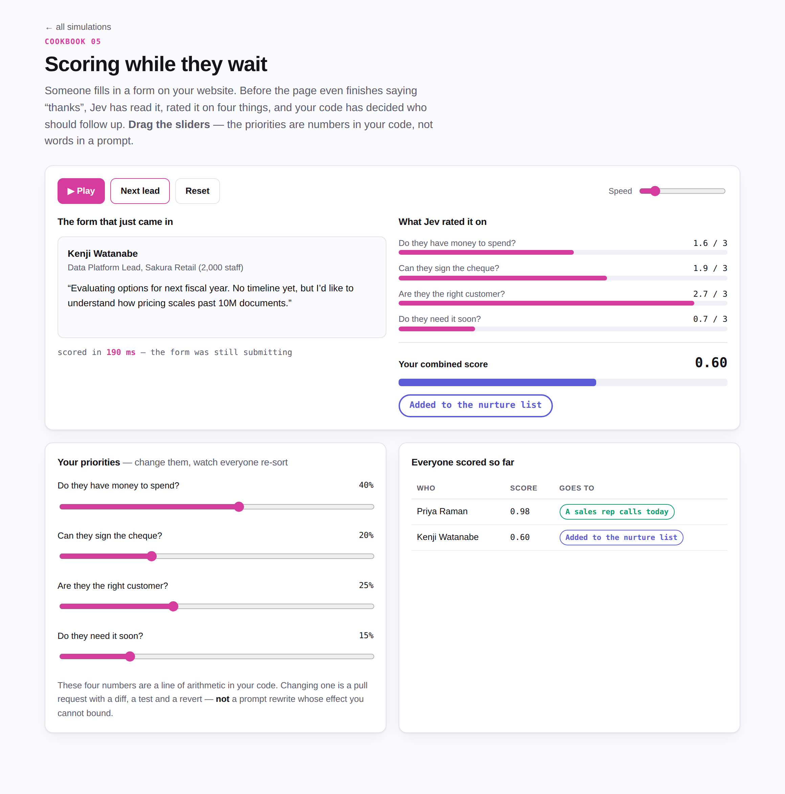

# Simulations

Animated, interactive versions of the six [cookbooks](../cookbooks) — built so a non-technical
colleague can see what the pattern does without reading Python.

**[▶ Open the live demos](https://exponen-agi.github.io/jev-playground/)**

[](https://exponen-agi.github.io/jev-playground/05-lead-scoring.html)

<sub>Simulation 05 — drag a weight and every lead scored so far re-sorts.</sub>

### GitHub will not render these — here is how to actually view them

GitHub serves `.html` files as *source code*, not as web pages. Clicking one here shows you
the markup. Three ways round that, cheapest first:

**1. Download and open locally.** Clone or download the repo, then open
`simulations/index.html` in any browser. No build step, no install, no API keys, no internet.

```bash
git clone https://github.com/exponen-agi/jev-playground.git
open jev-playground/simulations/index.html      # macOS
xdg-open jev-playground/simulations/index.html  # Linux
start jev-playground\simulations\index.html     # Windows
```

**2. GitHub Pages** — the repo ships [`.github/workflows/pages.yml`](../.github/workflows/pages.yml),
which deploys this folder on every push to `main`. It turns Pages on by itself the first time
it runs, so there is nothing to configure. The pages land at
`https://exponen-agi.github.io/jev-playground/` and every later push redeploys them.
The workflow also fails the build if any page references a file that does not exist.

> If your organisation blocks Pages, that first run fails with
> `Get Pages site failed`. Someone with admin rights then has to set
> **Settings → Pages → Build and deployment → Source: _GitHub Actions_** by hand, after which
> the workflow runs normally.

**3. A quick preview, no setup** — paste a file's GitHub URL into
[htmlpreview.github.io](https://htmlpreview.github.io/). Fine for a one-off look; it is a
third-party proxy, so do not rely on it for anything you are sharing widely.

> No AI is called. These are animations of the patterns with illustrative numbers, so the
> *shape* is legible. They are not measurements.

| | Page | Try |
|---|---|---|
| 01 | [Support triage cascade](./01-triage-cascade.html) | Drag the confidence floor and watch tickets move between the automated and human paths |
| 02 | [The gatekeeper](./02-rag-gatekeeper.html) | Raise the relevance bar; watch a prompt-injection document get quarantined |
| 03 | [The checkpoint](./03-agent-guardrails.html) | Move each hazard threshold independently and watch verdicts flip |
| 04 | [The second pair of eyes](./04-output-verifier.html) | Step through four drafts as six checks resolve |
| 05 | [Scoring while they wait](./05-lead-scoring.html) | Re-weight the formula and watch every lead re-sort live |
| 06 | [Picking the right brain](./06-model-router.html) | Watch requests fan out across no-model, small, reasoning and human paths |

Every page has **Play**, **Step**, **Reset** and a speed control, plus at least one threshold
you can drag — because the point of all six is that the thresholds live in your code, where
they have a diff and a revert.

## Files

```
index.html            landing page
0*-*.html             one self-contained page per cookbook
assets/sim.css        shared design tokens, light and dark
assets/sim.js         play/pause loop, stat helpers, deterministic RNG
assets/d3-mini.js     d3-selection + d3-transition + d3-ease (37 KB, vendored)
```

D3 is vendored rather than loaded from a CDN so the pages work offline and cannot break when
a CDN does. To rebuild it:

```bash
npm i d3-selection d3-transition d3-ease esbuild
echo 'export { select, selectAll } from "d3-selection";
export { transition } from "d3-transition";
export { easeCubicInOut, easeCubicOut, easeLinear } from "d3-ease";' > entry.js
npx esbuild entry.js --bundle --minify --format=iife --global-name=d3 --outfile=assets/d3-mini.js
```

## Notes

- Light and dark themes follow the operating system; SVG colours read from the same CSS
  variables as the rest of the page.
- Animations respect `prefers-reduced-motion`.
- Tested in headless Chromium at 1200px and 375px: no console errors, no failed requests,
  no horizontal scroll.
